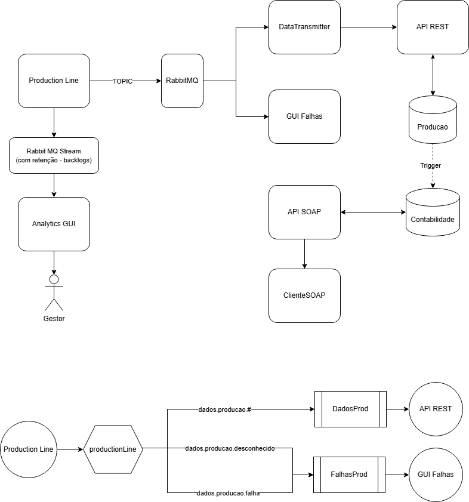
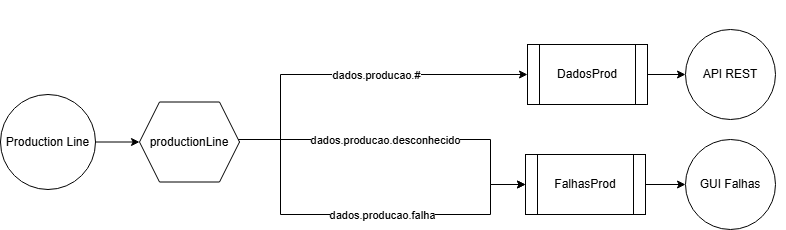
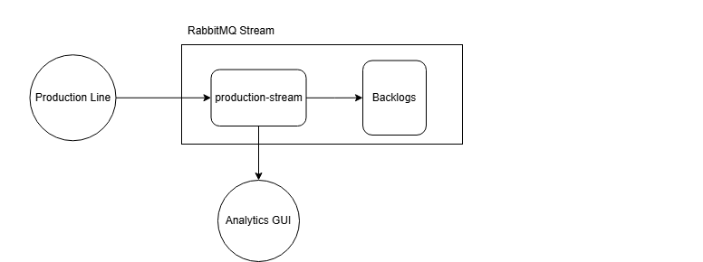
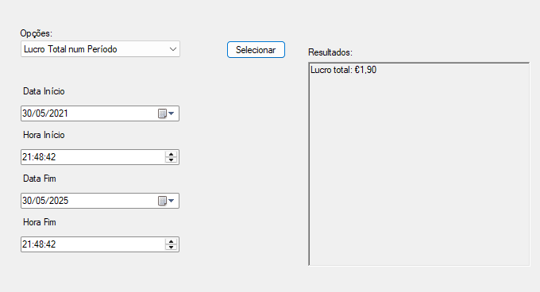

# Projeto de Integração de Sistemas

O projeto desenvolvido consiste na integração de sistemas com o objetivo de transmitir dados gerados por uma linha de produção a diferentes consumidores. A aplicação que simula a linha de produção é designada **Production Line** e gera dados aleatórios sobre peças em processo de fabrico. Esta aplicação consiste numa consola em C# que comunica de forma assíncrona, através do **Rabbit MQ**, com duas outras aplicações: uma aplicação de consola em C# denominada **Data Transmitter**, e uma aplicação com interface gráfica denominada **GUI Falhas**.
A aplicação **Data Transmitter** tem como função receber os dados da produção e enviá-los para uma API REST, que, por sua vez, insere os dados na **base de dados Producao**. Por outro lado, a aplicação  **GUI Falhas**, desenvolvida em Windows Forms, apresenta apenas os dados das peças cuja inspeção revelou falhas.
Paralelamente, a consola **Production Line** envia dados em tempo real para a aplicação **GUI Analytics**, utilizando o **RabbitMQ Stream**. Esta aplicação, também desenvolvida em Windows Forms, apresenta métricas analíticas sobre a produção com base nos dados recebidos via stream. 
Por fim, o sistema integra ainda uma **API SOAP** para disponibilizar dados financeiros. Esta API está ligada à **base de dados Contabilidade**, a qual é automaticamente atualizada com dados provenientes da base de dados Producao, por meio de um **trigger** numa das suas tabelas.

Em seguida apresenta-se um diagrama representativo do projeto:

## 🐰 RabbitMQ
A aplicação Production Line publica mensagens num exchange do tipo *topic* designado **productionLine**. Cada mensagem é publicada com uma *routing key* específica, que descreve o tipo de dado transmitido:
- dados.producao.falha -> sempre que o resultado do teste da peça está entre 2 e 5, inclusivé;
- dados.producao.sucesso -> sempre que o resultado do teste da peça é 1;
- dados.producao.desconhecido -> para qualquer outro resultado do teste da peça;

Esta exchange distribui as mensagens por diferentes filas com base nas *routing keys*:
- A fila **DadosProd** está configurada para receber todas as mensagens com o padrão **dados.produca.#**, ou seja, qualquer mensagens cuja *routing key* comece por dados.producao. Esta fila é consumida pela API REST, uma vez que o objetivo é inserir todas as peças produzidas na base de dados Prdicao;
- A fila **FalhasProd** recebe mensagens com *routing keys* mais específicas: **dados.producao.falha** e **dados.producao.desconhecido**. Ou seja, todos os dados de peças com falhas. Por esse motivo esta fila é consumida pela aplicação **GUI Falhas**, que apresenta apenas os dados de peças com falha;

Em seguida apresenta-se um diagrama que representa o fluxo de dados entre os componentes do sistema através do RabbitMQ:

## 🐰 RabbitMQ Stream

A aplicação **Production Line** publica os dados de produção no stream denominado **production-stream**. Este encaminha os dados tanto para um componente de armazenamento interno, onde são guardados backlogs, como para a aplicação **Analytics GUI**.  A aplicação **Analytics GUI**, desenvolvida para análise e visualização de métricas, consome os dados diretamente do stream, processando-os em tempo real para apresentar informações relevantes sobre a produção 

Em seguida apresenta-se um diagrama representativo do funcionamento da stream:

## 🧼 SOAP API

### 📌 Sistema Financeiro de Integração via API SOAP ###

Foi solicitado ao departamento de IT o desenvolvimento de uma **API com serviços financeiros**, com o objetivo de permitir que outros sistemas internos possam **consumir dados relevantes para a análise financeira da produção** . Para isso, foi criada uma **API baseada em Web Services SOAP** integrada na base de dados contabilidade.

A API expõe vários métodos financeiros através do serviço **'FinanceiroService.asmx'**, permitindo consultas sobre custos, lucros, prejuízos e detalhes de peças produzidas. Para facilitar o teste e a validação dos serviços, foi também desenvolvida uma aplicação cliente em **WinForms (.NET Framework) chamada ClienteSOAP**, com interface adaptável, que permite ao utilizador selecionar o método desejado e fornecer os parâmetros necessários de forma dinâmica.

### 📌 O que é uma API SOAP? ###

Uma **API SOAP (Simple Object Access Protocol)** é um serviço web baseado em **XML que permite a comunicação entre sistemas distribuídos**, independentemente das linguagens ou plataformas utilizadas. Utiliza o **protocolo HTTP** e mensagens formatadas em **XML para enviar e receber dados estruturados**, sendo amplamente usada em ambientes corporativos e **sistemas legados**. A sua robustez e padronização tornam-na ideal para integrações onde é **necessária maior segurança, validação de dados e contratos bem definidos (via WSDL).**

### 🧩 Tecnologias e ferramentas usadas ###

Este projeto foi desenvolvido com recurso a várias tecnologias e ferramentas integradas no ecossistema **.NET e SQL Server**:

  * 🔧 **C# (.NET Framework)** – Linguagem principal de programação para o Web Service e cliente WinForms.
  
  * 💻 **ASP.NET Web Aplication (.NET Framework) ** – Para criar a API SOAP (FinanceiroService.asmx) que expõe métodos financeiros (com wfc).
  
  * 🗃️ **SQL Server** – Utilizado como base de dados relacional para armazenar os dados de produção e contabilidade.
  
  * 🧪 **Stored Procedures** – Todas as operações da API são baseadas em procedimentos armazenados, com lógica no SQL Server (Nota: na pasta Queries, ficheiro contabilidade.sql, estão as stored procedures).
  
  * 🪟 **WinForms (.NET Framework)** – Interface gráfica desenvolvida para facilitar o teste e uso dos métodos SOAP.
  
  * 🔍 **Regex** – Utilizado para validar o formato do código das peças ([a-b][a-b][0-9]{6}).
  
  * 🔗 **WSDL / Service Reference** – Comunicação entre cliente (ClienteSOAP) e servidor feita através de WSDL gerado automaticamente.

### 🔧 Funcionalidades ###
A aplicação disponibiliza métodos financeiros acessíveis via Web Service SOAP, com foco na análise de dados de produção num intervalo temporal:
 * Custo total de produção;
 * Lucro total obtido com a produção;
 * Prejuízo total por peça; 
 * Peça com maior prejuízo;
 * Dados financeiros detalhados por código da peça;

### 🪟 Interface gráfica (WinForms (.NET Framework)) ###

  * ComboBox para selecionar o método desejado;
  * Painel dinâmico que exibe apenas os campos necessários:
  	- Se for Custo, Lucro ou Prejuízo surge campos para colocar a data e hora inicial e final;
  	- Se for Peça com maior prejuízo, não aparece nada, porque é direto;
  	- Dados financeiros detalhados por código da peça, surge um campo para colocar lá o número da peça que quer consultar;
  * Botão para selecionar para executar o método escolhido;
  * RichTextBox para exibir os resultados de forma dinâmica de acordo com o metodo executado;

### ✅ Validações incluídas ###

- Verificação do Formato do código da peça ('[a-b][a-b][0-9]{6}');
- Garantia de que data/hora inicial ≤ data/hora final;
- Tratamento de erros de conexão;
- Exibição de mensagens quando não há dados;

### 💻 Como testar? ###

1 - Executa a API SOAP (FinanceiroService.asmx) no Visual Studio (URL: http://localhost:52661/FinanceiroService.asmx); 
    
2 - Abre e executa o Cliente WinForm (ClienteSOAP); 
  
3 - Na aplicação:	
* Seleciona um método da lista da ComboBox;
* Preenche os campos exibidos no painel;
* Clica no botão "Selecionar"; 
    
4- Os resultados irão aparecer do lado direito dinâmicamente, de acordo com o método escolhido;
